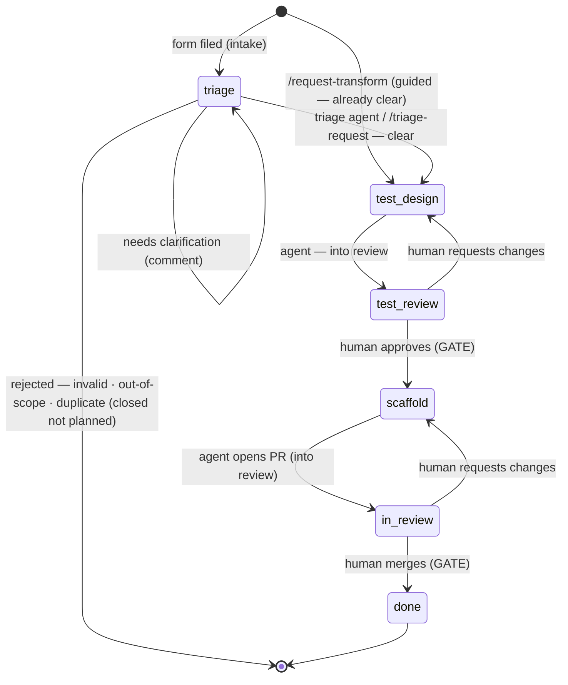

# Transform contribution lifecycle

The **state machine** every new-transform request moves through, from idea to merged code. Each
stage is a GitHub **label**; the label set is created by
[`.github/setup-labels.sh`](.github/setup-labels.sh), and a request enters the pipeline
automatically via the
[transform-request issue form](.github/ISSUE_TEMPLATE/transform-request.yml).

## The one rule

> **Agents only ever move work _into_ a review state. Humans own every gate.**

Automation can draft, scaffold, and hand work to a reviewer — it can never approve its own work,
advance past a review, or merge. The review states (`stage:test-review`, `stage:in-review`) and the
terminal `stage:done` are advanced by **humans only**.

## Label kinds

- **`type:transform-request`** — a *persistent* classifier; stays on the issue for its whole life so
  the work is always identifiable as a transform request.
- **`stage:*`** — the *current position* in the machine. Exactly one at a time; advancing = swapping
  the stage label.
- **`priority:low|medium|high`** — orthogonal; set at triage by a maintainer/PM.
- **`invalid` / `duplicate` / `out-of-scope`** — triage *rejection* outcomes; the issue is closed as
  **not planned** with a plain-language comment explaining how to come back (see
  [Triage guards](#triage-guards-protecting-core-contributors-time)).

## States

| Stage (label) | Owner who advances it | Fires on entry | → moves to |
|---|---|---|---|
| `type:transform-request` + `stage:triage` *(at filing, via form)* | — (auto, from the form) | Request enters **intake**; maintainer sets `priority:*` | `stage:triage` row below |
| `stage:triage` | 🤖 triage agent (auto on filing) — or 🧑 via `/triage-request` | **Guards, cheapest first:** template check (deterministic script) → scope guard (PyTorch / wrong area?) → duplicate guard (existing transform covers it?) → clarity check | `stage:test-design` *(clear)* — stays *(needs info)* — or **closed not planned** *(`invalid` / `out-of-scope` / `duplicate`)* |
| `stage:test-design` | 🤖 test-design agent (QA-assisted) | `design-transform-tests` drafts the test plan + failing tests, grounded in the closest existing transform pair — **auto-fires in CI** on the label (see [Automation](#automation-every--stage-runs-on-its-matching-surface)) | `stage:test-review` &nbsp;*(🤖 → into review)* |
| `stage:test-review` 🔒 **GATE** | 🧑 QA / maintainer | Human reviews the proposed tests. Nothing automated advances this. | `stage:scaffold` *(🧑 approves)* — or back to `stage:test-design` |
| `stage:scaffold` | 🤖 **cloud scaffold automation** (dispatched by the approval itself) | `/approve-tests` swaps the label **and POSTs the automation's webhook directly** (instant — no CI queue) → the Cursor **automation** launches its cloud agent, which runs [`/scaffold-transform`](.cursor/commands/scaffold-transform.md) in its own VM: array + dictionary pair, wiring, approved tests, green verification; opens a PR. Fallback: [`scaffold-agent.yml`](.github/workflows/scaffold-agent.yml) (manual dispatch) | `stage:in-review` &nbsp;*(🤖 opens PR → into review)* |
| `stage:in-review` 🔒 **GATE** | 🧑 maintainer / reviewer | PR open; CI + Bugbot + Security Review run; human reviews. Nothing auto-merges. | `stage:done` *(🧑 merges)* — or back to `stage:scaffold` |
| `stage:done` | 🧑 maintainer | PR merged, issue closed. Terminal. | — |

## Flow

🤖 agent-permitted transitions land **into** a review state.  🧑 every gate (out of review, and merge)
is human-only.

## How a request enters

Filing the [transform-request form](.github/ISSUE_TEMPLATE/transform-request.yml) auto-applies
`type:transform-request` **and** `stage:triage` (via the form's `labels:` key), so even a manual filing
lands in **intake**. A triager then runs [`/triage-request`](.cursor/commands/triage-request.md): if the
request is clear enough to design a test, it advances to `stage:test-design`; if not, the command posts
plain-language clarification questions and holds it in triage until the requester replies.

The guided [`/request-transform`](.cursor/commands/request-transform.md) command interviews to
completeness, then enters at `stage:triage` like every other path. The interview is a strong *clarity*
gate, but clarity is only one of four guards — **scope** and **duplicate** need the library, not the
requester (a well-run interview once filed a perfect duplicate: #16). Same door for everyone; the
guards run on every entry path. The requester's **Priority** answer is a suggestion; a maintainer
applies the matching `priority:*` label (GitHub forms can't map a dropdown choice to a label
automatically).

> Run [`.github/setup-labels.sh`](.github/setup-labels.sh) once before relying on the form — the
> `labels:` auto-apply only works for labels that already exist on the repo.

## Triage guards: protecting core contributors' time

The single biggest cost in this repo is **maintainer attention** (top-12 humans ≈ 83% of commits;
median PR review 13 days). Triage is therefore an automated front door —
[`.github/workflows/triage-agent.yml`](.github/workflows/triage-agent.yml) fires on every new
transform request (form filing, `[Transform]` title, or a human re-applying `stage:triage`) and
answers the requests that should never reach a human. **Guards run cheapest-first:**

| # | Guard | Layer | Outcome when it trips |
|---|---|---|---|
| 1 | **Template** — required sections present & non-empty ([`check-transform-template.py`](.github/scripts/check-transform-template.py)) | deterministic script — *zero agent cost* | comment what's missing + link to the form → `invalid` → **closed not planned** |
| 2 | **Scope** — generic tensor/framework op (→ PyTorch) or a network/loss/metric (→ other MONAI area, standard template) | 🤖 agent | redirect comment → `out-of-scope` → **closed not planned** |
| 3 | **Duplicate** — an existing transform demonstrably covers it (e.g. "rotate 120°" → `Rotate(angle=…)`) | 🤖 agent | comment naming the transform + docs → `duplicate` → **closed not planned** |
| 4 | **Clarity** — could engineering write a correctness test from this? | 🤖 agent | questions posted, **held** at `stage:triage` |

Rejections are polite and reversible: closed **not planned**, always with the way back (refile via
the form, or reply to appeal — a maintainer can reopen). The agent rejects **only when confident**;
when unsure it falls through to clarity questions. Canonical logic:
[`triage-transform-request`](.cursor/skills/triage-transform-request/SKILL.md) — the same skill a
human triager runs via [`/triage-request`](.cursor/commands/triage-request.md).

## Automation: every 🤖 stage runs on its matching surface

Each automated stage runs on the surface whose **permissions and runtime match the work** —
issue mutations need a token with `issues: write` (GitHub Actions); building code needs a dev VM,
a branch, and a PR (a Cursor cloud agent):

| 🤖 Stage | Surface | Why this surface |
|---|---|---|
| triage | script + Cursor CLI in Actions | needs `issues: write` (comment/label/close) — the Action's `GITHUB_TOKEN` has it |
| test-design | Cursor CLI in Actions | same: posts the plan, swaps labels |
| scaffold | **Cursor cloud automation** (dashboard-configured agent) | needs to write code, run the test suite, push a branch, open a PR — the cloud agent's native shape, and PR creation is a write its minted token fully supports |

Two workflows make the label-driven stages fire, running the **same skill files** the editor
uses, headless via the Cursor CLI (`agent -p`, authenticated by the `CURSOR_API_KEY` repo secret):

- [`triage-agent.yml`](.github/workflows/triage-agent.yml) — on issue **opened** / `stage:triage`
  labeled → [`triage-transform-request`](.cursor/skills/triage-transform-request/SKILL.md)
- [`test-design-agent.yml`](.github/workflows/test-design-agent.yml) — on `stage:test-design`
  labeled → [`design-transform-tests`](.cursor/skills/design-transform-tests/SKILL.md)

Cursor cloud automations can't yet trigger on a label change, and their minted token lacks
`issues: write` — the Actions supply both: GitHub delivers the event, and each workflow's own
`GITHUB_TOKEN` authenticates `gh`. Control mirrors the enforcement layers below:

- tokens are scoped per workflow (`issues: write` + `contents: read`; triage adds `actions: write`
  for chaining) — they **cannot** push code, approve, or merge, however the agent misbehaves;
- a CI-only `.cursor/cli.json` denies file writes and allows only read/inspect commands plus `gh`/`git`;
- issue content is treated as **untrusted input** — the skills forbid following instructions found
  in issue bodies or comments;
- label changes made with `GITHUB_TOKEN` never trigger workflows (loop-safe by GitHub guarantee) —
  which is also why triage **explicitly dispatches** `test-design-agent.yml` on advance:
  *workflow_dispatch events always create runs*, so the chain is deliberate, visible, and the only
  agent-to-agent hand-off in the machine. Both hand-offs still land **into** review states only.

### The scaffold stage: a cloud automation dispatched by the approval itself

The scaffold agent is a **Cursor automation** configured in the dashboard — its prompt, model, and
tools live in Cursor, not in CI. The human approval is the dispatch, **synchronously**:
`/approve-tests` swaps the issue to `stage:scaffold` and POSTs the automation's private **webhook**
from the approver's own machine (credentials in the approver's local environment). This keeps the
demo-critical hop off shared CI runners — no queue between "approved" and "building". Two fallbacks,
in order: [`scaffold-agent.yml`](.github/workflows/scaffold-agent.yml) (manual `workflow_dispatch`,
same webhook via Actions with the repo secrets — may queue), or running the automation by hand from
the dashboard. A label-event trigger is deliberately **not** used: the poke and the label swap
travel together in `/approve-tests`, and a label trigger would double-dispatch. (Cursor automations
also can't trigger on *issue*-label changes — PR labels only, verified in the dashboard — which is
why a webhook is the integration point at all.)

The cloud agent clones the repo, installs the dev environment from
[`.cursor/environment.json`](.cursor/environment.json), and works on its own branch — the repo's
rules **and command hooks bind it in the cloud** (guard-shell still denies merges from inside the
VM). It finishes by opening the PR — moving the work *into* `stage:in-review`, never past it.
Known platform gap, stated honestly: the cloud agent's minted token cannot edit issue labels, so if
the `stage:scaffold → stage:in-review` label swap fails, the agent notes it in the PR body and the
human reviewer applies the label at the gate they own. (`FlipBrightness` — PR #4,
`Co-authored-by: Cursor` — was scaffolded exactly this way.)

## Enforcement: advisory → deterministic → server-side

"Humans own every gate" is backed by **three layers**, weakest to strongest:

| Layer | Where | What it does | Bypassable? |
|---|---|---|---|
| **Advisory** | [`.cursor/rules/agent-boundaries.mdc`](.cursor/rules/agent-boundaries.mdc) (always-on rule) | Tells the agent the read-only zones and gate rules | Yes — guidance the model usually follows |
| **Deterministic (client)** | [`.cursor/hooks.json`](.cursor/hooks.json) + `.cursor/hooks/*.py` | Hard-blocks the action *before it runs* — `failClosed: true` | Only outside Cursor |
| **Server-side** | GitHub branch protection + required review + [`.github/CODEOWNERS`](.github/CODEOWNERS) | The unbypassable gate — nothing merges to `dev` without human approval | No |

The hooks make the boundaries **mechanical, not just documented**:
- `guard-file-edits.py` (`preToolUse`) denies writes to `monai/{networks,csrc,_extensions,data,engines,apps}/`,
  `.github/workflows/`, `CODEOWNERS`, build/config — **and the guardrails themselves**, so an agent can't
  disable its own boundaries.
- `guard-shell.py` (`beforeShellExecution`) lets the agent open PRs and move labels *into* review, but denies
  **merging**, pushing to `dev`/`main`, force-push, and issue/label/branch deletion.

> Scope: hooks run in Cursor (and Cursor cloud agents — command-based hooks only); they don't bind plain-git
> or other editors. The **server-side** layer is the real, final gate.
