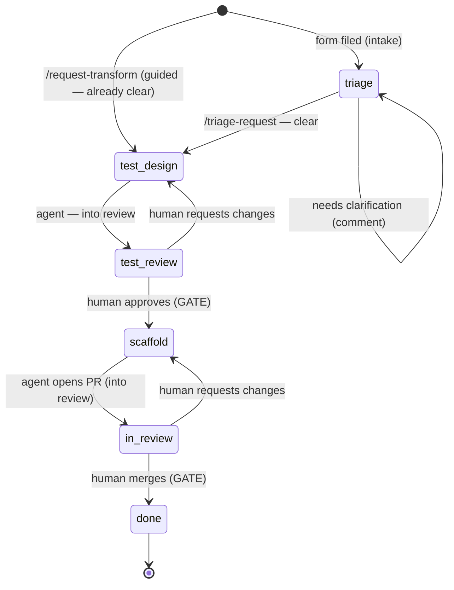

# Transform contribution lifecycle

The **state machine** every new-transform request moves through, from idea to merged code. Each
stage is a GitHub **label**; the label set is created by
[`.github/setup-labels.sh`](.github/setup-labels.sh), and a request enters the pipeline
automatically via the
[transform-request issue form](.github/ISSUE_TEMPLATE/transform-request.yml).

## The one rule

> **Agents only ever move work _into_ a review state. Humans own every gate.**

Automation can draft, scaffold, and hand work to a reviewer — it can never approve its own work,
advance past a review, or merge. The review states (`stage:test-review`, `stage:in-review`) and the
terminal `stage:done` are advanced by **humans only**.

## Label kinds

- **`type:transform-request`** — a *persistent* classifier; stays on the issue for its whole life so
  the work is always identifiable as a transform request.
- **`stage:*`** — the *current position* in the machine. Exactly one at a time; advancing = swapping
  the stage label.
- **`priority:low|medium|high`** — orthogonal; set at triage by a maintainer/PM.

## States

| Stage (label) | Owner who advances it | Fires on entry | → moves to |
|---|---|---|---|
| `type:transform-request` + `stage:triage` *(at filing, via form)* | — (auto, from the form) | Request enters **intake**; maintainer sets `priority:*` | `stage:triage` row below |
| `stage:triage` | 🧑 triager (via `/triage-request`) | Clarity check — if vague, post specific questions and **hold**; if clear, advance | `stage:test-design` *(clear)* — or stays (needs info) |
| `stage:test-design` | 🤖 test-design agent (QA-assisted) | `design-transform-tests` drafts the test plan + failing tests, grounded in the closest existing transform pair | `stage:test-review` &nbsp;*(🤖 → into review)* |
| `stage:test-review` 🔒 **GATE** | 🧑 QA / maintainer | Human reviews the proposed tests. Nothing automated advances this. | `stage:scaffold` *(🧑 approves)* — or back to `stage:test-design` |
| `stage:scaffold` | 🤖 scaffold agent + engineer | `/scaffold-transform` generates the array + dictionary pair, wiring, and the approved tests; opens a PR | `stage:in-review` &nbsp;*(🤖 opens PR → into review)* |
| `stage:in-review` 🔒 **GATE** | 🧑 maintainer / reviewer | PR open; CI + Bugbot + Security Review run; human reviews. Nothing auto-merges. | `stage:done` *(🧑 merges)* — or back to `stage:scaffold` |
| `stage:done` | 🧑 maintainer | PR merged, issue closed. Terminal. | — |

## Flow

🤖 agent-permitted transitions land **into** a review state.  🧑 every gate (out of review, and merge)
is human-only.

## How a request enters

Filing the [transform-request form](.github/ISSUE_TEMPLATE/transform-request.yml) auto-applies
`type:transform-request` **and** `stage:triage` (via the form's `labels:` key), so even a manual filing
lands in **intake**. A triager then runs [`/triage-request`](.cursor/commands/triage-request.md): if the
request is clear enough to design a test, it advances to `stage:test-design`; if not, the command posts
plain-language clarification questions and holds it in triage until the requester replies.

The guided [`/request-transform`](.cursor/commands/request-transform.md) command interviews to
completeness, so requests filed that way enter directly at `stage:test-design` — the interview *is* the
clarity gate. The requester's **Priority** answer is a suggestion; a maintainer applies the matching
`priority:*` label (GitHub forms can't map a dropdown choice to a label automatically).

> Run [`.github/setup-labels.sh`](.github/setup-labels.sh) once before relying on the form — the
> `labels:` auto-apply only works for labels that already exist on the repo.

## Enforcement: advisory → deterministic → server-side

"Humans own every gate" is backed by **three layers**, weakest to strongest:

| Layer | Where | What it does | Bypassable? |
|---|---|---|---|
| **Advisory** | [`.cursor/rules/agent-boundaries.mdc`](.cursor/rules/agent-boundaries.mdc) (always-on rule) | Tells the agent the read-only zones and gate rules | Yes — guidance the model usually follows |
| **Deterministic (client)** | [`.cursor/hooks.json`](.cursor/hooks.json) + `.cursor/hooks/*.py` | Hard-blocks the action *before it runs* — `failClosed: true` | Only outside Cursor |
| **Server-side** | GitHub branch protection + required review + [`.github/CODEOWNERS`](.github/CODEOWNERS) | The unbypassable gate — nothing merges to `dev` without human approval | No |

The hooks make the boundaries **mechanical, not just documented**:
- `guard-file-edits.py` (`preToolUse`) denies writes to `monai/{networks,csrc,_extensions,data,engines,apps}/`,
  `.github/workflows/`, `CODEOWNERS`, build/config — **and the guardrails themselves**, so an agent can't
  disable its own boundaries.
- `guard-shell.py` (`beforeShellExecution`) lets the agent open PRs and move labels *into* review, but denies
  **merging**, pushing to `dev`/`main`, force-push, and issue/label/branch deletion.

> Scope: hooks run in Cursor (and Cursor cloud agents — command-based hooks only); they don't bind plain-git
> or other editors. The **server-side** layer is the real, final gate.
